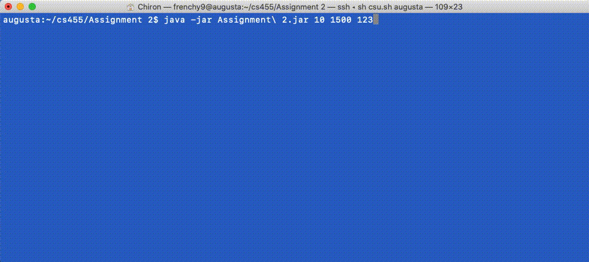

# CS455 Distributed Systems

## Assignment 1

- TCP Connections over the internet between a variable number of nodes
- Nodes randomly initiate connections with other nodes in the network and send random integers
- Correctly recieve and read marshalled data and close the connection
- Nodes keep track of how many messages they have sent and received and the sums of these two numbers
- Institute threading such that multiple connections can be made at once to optimize the network
- At the end the # of Messages sent and Messages recieved as well as the Sum send and Sum recieved should be equal
- Implement safe threading procedures with locks to prevent race conditions

Below is a working demo of the program, for ease of use a script can be utlized to ssh into each machine and start the jar file.

## Assignment 2

- Generate 4 matrixes from a seed provided at run time
- Create a thread pool with # of threads provided at run time
- Do matrix multiplcation A * B = X and C * D = Y and X * Y = Z for matrixes of size 300 to 3000
- Allow threads to complete tasks in a concurrent yet thread safe manner
- Use latches to time the length it takes each matrix to finish execution
- Sum of matrixes should always be the same when the same seed and same size is provided, regardless of the number of threads however execution should be faster
- Use atomic operations to prevent race conditions

java -jar Assignment 2.jar [Number of Threads] [Size of Matrixes] [Seed]

